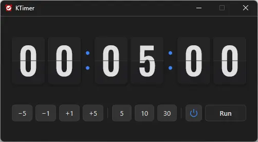

# KTimer

**Un minuteur d'arrêt gratuit pour Windows : quand le temps choisi est écoulé, il éteint le PC ou le met en veille.**

[English](README.md) · [한국어](README.ko.md) · [简体中文](README.zh-CN.md) · [日本語](README.ja.md) · [Español](README.es.md) · [Português (Brasil)](README.pt-BR.md) · Français

> Ce document est une traduction. En cas de différence, la [version coréenne](README.ko.md) fait foi.

-0078D4)

## Présentation

S'endormir devant un film, laisser tourner un long téléchargement ou une sauvegarde pendant qu'on s'absente — parfois, on voudrait juste que le PC s'éteigne tout seul une fois le travail terminé.

Avec KTimer, réglez la durée en quelques clics et appuyez sur **Exécuter**. Une horloge à volets décompte jusqu'à zéro, puis le PC s'éteint. Au lieu de l'éteindre, vous pouvez aussi le mettre en **hibernation ou en veille**.

Juste avant l'arrêt, KTimer **capture l'écran et vous le montre au prochain démarrage du PC.** Le matin, vous voyez d'un coup d'œil si le téléchargement est terminé et quelles fenêtres étaient ouvertes.

## Fonctionnalités

- **Arrêt programmé** — De 1 minute à 7 heures ; le PC s'éteint quand le temps est écoulé.
- **Hibernation · Veille** — Endormez le PC au lieu de l'éteindre. KTimer choisit ce que ce PC prend en charge.
- **Voir le dernier écran** — L'écran juste avant l'arrêt est enregistré et affiché dans le navigateur au démarrage suivant.
- **Horloge à volets** — Le temps restant s'affiche en grandes cartes heures : minutes : secondes, lisibles d'un coup d'œil.
- **Réglage par boutons** — `−5` `−1` `+1` `+5` ajoutent et retirent ; `5` `10` `30` fixent directement la valeur.
- **Rien à configurer** — Pas de fenêtre de réglages, pas de droits d'administrateur ; un seul exécutable.
- **9 langues** — Coréen · anglais · japonais · chinois · russe · italien · français · espagnol · arabe. Suit la langue d'affichage de Windows.

## Téléchargement / Installation

| Type | Lien |
|---|---|
| Installateur | [Télécharger](https://down.kilho.net/ktimer?lang=fr) |
| Portable (ZIP) | [Télécharger](https://down.kilho.net/ktimer?lang=fr&nosetup) |

Avec l'installateur, KTimer s'ouvre dès la fin de l'installation et s'ajoute au menu Démarrer. Pour la version portable, décompressez le ZIP et lancez `KTimer.exe`.

## Utilisation

### Déroulement de base

1. Lancez KTimer. La fenêtre s'ouvre au centre de l'écran, l'horloge prête sur **00 : 05 : 00** (5 minutes).
2. Réglez la durée avec les boutons. Par exemple : `30` → 30 minutes ; `30` puis `+5` six fois → 1 heure.
3. Regardez l'icône d'alimentation pour savoir ce qui va se passer. Le **symbole marche/arrêt** signifie éteindre ; cliquez une fois pour passer à la **lune** et mettre en veille.
4. Appuyez sur **Exécuter**. L'horloge diminue seconde par seconde, et les points entre les chiffres clignotent pour indiquer le décompte.
5. À zéro, le bouton devient **Extinction…** (ou **Hibernation en cours…** / **Mise en veille…**) et le PC s'éteint ou s'endort. KTimer se ferme avec lui.

### Organisation de l'écran

| Élément | Rôle |
|---|---|
| Horloge à volets | Temps restant (heures : minutes : secondes). Les points clignotent pendant le décompte |
| `−5` `−1` `+1` `+5` | Retirent ou ajoutent autant de minutes |
| `5` `10` `30` | Fixent directement la durée à ce nombre de minutes |
| Icône d'alimentation | Chaque clic bascule **Éteindre** (symbole marche/arrêt) ↔ **Veille** (lune). Survolez‑la pour voir son nom |
| **Exécuter** / **Arrêter** | Démarrer / arrêter le décompte |

- Pendant le décompte, les boutons de durée et l'icône d'alimentation se masquent et seul **Arrêter** reste : la durée ne peut pas être modifiée par erreur.
- La plage va de **1 minute à 7 heures**. Au‑delà, la valeur s'arrête à la limite.

### Que faire quand…

**S'endormir devant un film ou de la musique**
Un film dure en général environ 2 heures. Appuyez sur `30`, ajoutez de la marge avec `+5`, appuyez sur **Exécuter** et dormez tranquille. Le PC s'éteint vers la fin.

**Laisser tourner un téléchargement, une sauvegarde ou une conversion vidéo**
Programmez la durée prévue de la tâche, avec un peu de marge (jusqu'à 7 heures). Au prochain démarrage du PC, le dernier écran avant l'arrêt s'ouvre : vous vérifiez aussitôt si la tâche est vraiment terminée.

**Voir ce qu'il y avait à l'écran juste avant l'arrêt**
Quand KTimer éteint le PC, il enregistre l'écran du **moniteur où se trouvait la souris**. Au prochain démarrage, après l'ouverture de session, le navigateur par défaut s'ouvre et affiche cet écran. Vous n'avez rien à faire.
- Avec plusieurs moniteurs, laissez la souris sur celui qui affiche la fenêtre à vérifier.
- Ceci ne concerne que **Éteindre**. En veille, l'écran est toujours là au réveil du PC, ce n'est donc pas nécessaire.

**Vous avez des documents non enregistrés**
À l'heure dite, les autres programmes ne peuvent pas retenir l'arrêt : le PC s'éteint à coup sûr. Il ne reste jamais allumé toute la nuit bloqué sur un « Enregistrer les modifications ? », mais **ce qui n'est pas enregistré n'est pas conservé** : enregistrez avant d'appuyer sur Exécuter.

**Endormir le PC au lieu de l'éteindre**
Avant d'appuyer sur Exécuter, cliquez sur l'icône d'alimentation pour passer à la **lune**. Survolez l'icône pour voir ce que ce PC fera réellement.
- **Hibernation** — Enregistre les fenêtres ouvertes et le travail, puis coupe l'alimentation. Au rallumage, tout revient comme avant.
- **Veille** — Attend en consommant très peu d'énergie. Se réveille rapidement.
Les PC qui prennent en charge l'hibernation hibernent ; les autres se mettent en veille. KTimer vérifie de nouveau juste avant d'agir : si vous modifiez les paramètres d'alimentation pendant l'attente, il les suit.

**Annuler ou modifier la programmation**
Appuyez sur **Arrêter** pour suspendre le décompte et faire réapparaître les boutons de durée. Ajustez la durée puis appuyez sur **Exécuter** pour repartir de cette durée. Pour tout annuler, il suffit de fermer la fenêtre : la programmation est annulée avec elle.

**La fenêtre gêne**
**Réduisez‑la** : elle continue de décompter en arrière‑plan. Rouvrez‑la depuis la barre des tâches pour voir le temps restant.

**Je ne trouve plus la fenêtre**
Relancez KTimer. Au lieu d'en ouvrir une nouvelle, la fenêtre qui décompte déjà passe au premier plan (une seule programmation à la fois).

**Astuces pour régler la durée rapidement**
- Pour les classiques 5 · 10 · 30 minutes, appuyez une fois sur le bouton.
- 1 heure, c'est `30` puis `+5` six fois ; 45 minutes, `30` puis `+5` trois fois.
- Affinez à la minute avec `+1` · `−1`. Même en appuyant sans cesse sur `−1`, on ne descend jamais sous 1 minute.

## Configuration

Pas de fenêtre de réglages et rien n'est enregistré. Chaque lancement commence ainsi :

| Élément | Valeur de départ |
|---|---|
| Durée | 5 minutes |
| Action | Éteindre |
| Apparence | Thème sombre |
| Langue | Langue d'affichage de Windows (anglais si elle n'est pas prise en charge) |

## Configuration requise

- Windows 10 · Windows 11 (64 bits)
- Aucun droit d'administrateur ni runtime supplémentaire pour exécuter le programme.
- Le dernier écran s'ouvre dans le navigateur par défaut. La connexion Internet ne sert qu'à cet affichage et aux avis de nouvelle version.

## Mises à jour

KTimer ne se met **pas** à jour tout seul. Au lancement, il vérifie si une nouvelle version existe et affiche un avis ; en appuyant sur **Oui**, la page de téléchargement s'ouvre et le programme se ferme. Les nouvelles versions sont publiées manuellement après vérification interne et annoncées sur la [page KTimer](https://v2.kilho.net/ktimer). Consultez l'[avis sur la politique de mise à jour](https://en.kilho.net/archives/notice/2940).

**Historique des versions**

| Version | Date | Modifications |
|---|---|---|
| 2.0.0 | 2026-09-23 | Refonte complète : horloge à volets, durée réglée directement par boutons, arrêt ou veille choisis par une icône, couleurs et police de chiffres adaptées à l'interface sombre, plus léger et plus fluide |
| 1.3.2 | 2026-08-21 | Menus et comportement adaptés à la prise en charge de l'hibernation, meilleur passage en veille, améliorations du démarrage automatique et de la vérification des mises à jour |
| 1.3.1 | 2024-11-16 | Ajout de l'italien · du français · du russe · du chinois |
| 1.3.0 | 2024-11-03 | Prise en charge de l'hibernation, empêche le double lancement, améliorations multilingues et des avis de mise à jour |

## Licence

KTimer est un **freeware**. Utilisez‑le gratuitement et sans restriction partout — au bureau, à la maison, dans les administrations, à l'école — et redistribuez‑le librement.

## Liens

- Site web : <https://v2.kilho.net/ktimer>
- Forum : <https://groups.google.com/g/kilhonet>
- X (Twitter) : <https://www.twitter.com/kilhonet>

© KILHO.NET
