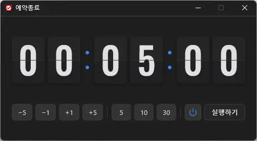

# 예약종료

**정한 시간이 지나면 컴퓨터를 끄거나 절전 모드로 보내 주는, Windows 용 무료 예약 종료 프로그램.**

[English](README.md) · 한국어 · [简体中文](README.zh-CN.md) · [日本語](README.ja.md) · [Español](README.es.md) · [Português (Brasil)](README.pt-BR.md) · [Français](README.fr.md)

-0078D4)

## 개요

영화를 틀어 놓고 잠들 때, 긴 다운로드나 백업을 걸어 두고 자리를 뜰 때 — "끝날 즈음 컴퓨터가 알아서 꺼졌으면" 싶을 때가 있습니다.

예약종료는 시간을 버튼 몇 번으로 맞추고 **실행하기**를 누르면, 플립 시계가 0 까지 센 뒤 컴퓨터를 끕니다. 끄는 대신 **최대 절전 · 절전 모드**로 보낼 수도 있습니다.

컴퓨터를 끄기 직전에는 **그때의 화면을 갈무리해 두었다가, 다음에 켰을 때 보여 줍니다.** 잠든 사이 다운로드가 다 끝났는지, 어떤 창이 떠 있었는지 아침에 바로 확인할 수 있습니다.

## 주요 기능

- **예약 종료** — 1분부터 최대 7시간까지, 정한 시간이 지나면 컴퓨터를 끕니다.
- **최대 절전 · 절전 모드** — 끄는 대신 재워 둘 수도 있습니다. 이 PC 에서 되는 쪽을 알아서 고릅니다.
- **꺼지기 직전 화면 보기** — 종료 직전 화면을 저장해 두고, 다음 부팅 때 브라우저로 보여 줍니다.
- **플립 시계** — 남은 시간이 시 : 분 : 초 로 넘어가는 큼직한 숫자 카드로 한눈에 보입니다.
- **버튼만으로 시간 설정** — `−5` `−1` `+1` `+5` 로 더하고 빼고, `5` `10` `30` 으로 바로 놓습니다.
- **설치·설정 필요 없음** — 설정 창이 없고, 관리자 권한 없이 실행 파일 하나로 동작합니다.
- **9개 언어** — 한국어 · 영어 · 일본어 · 중국어 · 러시아어 · 이탈리아어 · 프랑스어 · 스페인어 · 아랍어. Windows 표시 언어를 따릅니다.

## 다운로드 / 설치

| 구분 | 링크 |
|---|---|
| 설치 파일 | [다운로드](https://down.kilho.net/ktimer?lang=ko) |
| 무설치 (ZIP) | [다운로드](https://down.kilho.net/ktimer?lang=ko&nosetup) |

설치판은 설치가 끝나면 바로 예약종료가 열리고 시작 메뉴에 등록됩니다. 무설치판은 ZIP 을 풀고 `KTimer.exe` 를 실행하면 됩니다.

## 사용법

### 처음 사용하기

1. 예약종료를 실행합니다. 화면 가운데에 창이 뜨고, 시계는 **00 : 05 : 00**(5분)으로 준비되어 있습니다.
2. 시간 버튼으로 원하는 시간을 맞춥니다. 예: `30` → 30분, `30` 뒤 `+5` 여섯 번 → 1시간.
3. 전원 아이콘을 보고 할 일을 확인합니다. **전원 기호**면 컴퓨터 종료, 한 번 눌러 **달**로 바꾸면 절전입니다.
4. **실행하기**를 누릅니다. 시계가 1초씩 줄어들고, 시간 사이의 점이 깜빡이며 세는 중임을 알려 줍니다.
5. 0 이 되면 버튼이 **종료중**(또는 **최대 절전중** / **절전중**)으로 바뀌고, 컴퓨터가 꺼지거나 잠듭니다. 예약종료도 함께 닫힙니다.

### 화면 구성

| 요소 | 하는 일 |
|---|---|
| 플립 시계 | 남은 시간(시 : 분 : 초). 세는 동안 가운데 점이 깜빡입니다 |
| `−5` `−1` `+1` `+5` | 예약 시간을 그만큼 빼고 더합니다 (분) |
| `5` `10` `30` | 예약 시간을 그 값(분)으로 바로 놓습니다 |
| 전원 아이콘 | 누를 때마다 **컴퓨터 종료**(전원 기호) ↔ **절전**(달) 전환. 마우스를 올리면 이름이 나옵니다 |
| **실행하기** / **중지하기** | 세기 시작 / 멈춤 |

- 세는 동안에는 시간 버튼과 전원 아이콘이 숨고 **중지하기**만 남습니다. 실수로 눌러 시간이 바뀌는 일이 없습니다.
- 예약 시간은 **1분 ~ 7시간**입니다. 그보다 줄이거나 늘려도 그 끝에서 멈춥니다.

### 이럴 때 이렇게

**영화나 음악을 틀어 놓고 잠들 때**
보통 영화 한 편이면 2시간 안팎입니다. `30` 을 누른 뒤 `+5` 로 넉넉히 맞추고 **실행하기**를 누르고 주무세요. 끝날 즈음 컴퓨터가 꺼집니다.

**다운로드 · 백업 · 영상 변환을 걸어 두고 자리를 뜰 때**
작업이 끝날 만한 시간에 여유를 조금 더해 예약합니다(최대 7시간). 다음에 컴퓨터를 켜면 꺼지기 직전 화면이 열리므로, 작업이 정말 끝났는지 바로 확인할 수 있습니다.

**꺼지기 직전에 무슨 화면이었는지 보고 싶을 때**
예약종료가 컴퓨터를 끌 때는 **마우스가 있던 모니터**의 화면을 저장해 둡니다. 다음에 켜고 로그인하면 기본 브라우저가 열려 그 화면을 보여 줍니다. 따로 할 일은 없습니다.
- 모니터가 여럿이면, 확인하고 싶은 창이 있는 모니터에 마우스를 올려 두고 자리를 뜨세요.
- 이 화면 보기는 **컴퓨터 종료**일 때만 있습니다. 절전은 깨우면 화면이 그대로 남아 있으니 필요 없습니다.

**저장하지 않은 문서가 있을 때**
예약 시간이 되면 다른 프로그램이 종료를 붙잡지 않고 확실히 꺼집니다. 저장을 묻는 창에서 멈춰 밤새 켜져 있는 일이 없는 대신, **저장하지 않은 내용은 남지 않으니** 실행하기 전에 저장해 두세요.

**끄지 말고 재워 두고 싶을 때**
실행하기 전에 전원 아이콘을 눌러 **달** 모양으로 바꿉니다. 아이콘에 마우스를 올리면 이 PC 에서 실제로 할 일이 나옵니다.
- **최대 절전 모드** — 열어 둔 창과 작업을 그대로 저장하고 전원을 끕니다. 다시 켜면 그 상태로 돌아옵니다.
- **절전 모드** — 전기를 아주 조금 쓰며 대기합니다. 금방 깨어납니다.
최대 절전이 가능한 PC 는 최대 절전을, 그렇지 않은 PC 는 절전을 씁니다. 실행 직전에 한 번 더 확인하므로, 기다리는 사이 전원 설정을 바꿔도 그에 맞춰 동작합니다.

**예약을 취소하거나 시간을 바꾸고 싶을 때**
**중지하기**를 누르면 세기가 멈추고 시간 버튼이 다시 나타납니다. 시간을 고친 뒤 **실행하기**를 누르면 그 시간부터 새로 셉니다. 아예 취소하려면 창을 닫아도 됩니다 — 창이 닫히면 예약도 없어집니다.

**창이 거슬릴 때**
창을 **최소화**해 두어도 뒤에서 계속 셉니다. 남은 시간이 궁금하면 작업 표시줄에서 다시 열면 됩니다.

**창이 어디 갔는지 모를 때**
예약종료를 한 번 더 실행하세요. 새로 뜨지 않고 이미 세고 있는 창이 앞으로 나옵니다(예약은 하나만 걸립니다).

**시간을 빨리 맞추는 요령**
- 자주 쓰는 5 · 10 · 30분은 해당 버튼 한 번.
- 1시간은 `30` 뒤 `+5` 여섯 번, 45분은 `30` 뒤 `+5` 세 번.
- 1분 단위는 `+1` · `−1` 로 다듬습니다. `−1` 을 계속 눌러도 1분 아래로는 내려가지 않습니다.

## 설정

설정 창이 없고 저장하는 설정도 없습니다. 실행할 때마다 아래 상태로 시작합니다.

| 항목 | 시작 값 |
|---|---|
| 예약 시간 | 5분 |
| 할 일 | 컴퓨터 종료 |
| 화면 | 어두운 테마 |
| 언어 | Windows 표시 언어 (지원하지 않는 언어면 영어) |

## 요구 사항

- Windows 10 · Windows 11 (64비트)
- 프로그램 실행에 관리자 권한이나 추가 런타임이 필요 없습니다.
- 꺼지기 직전 화면 보기는 기본 브라우저로 열립니다. 인터넷 연결은 이 화면과 새 버전 안내에만 씁니다.

## 업데이트

예약종료는 자동으로 업데이트하지 **않습니다**. 실행할 때 새 버전이 있는지 확인해 안내 창을 띄우고, **[예]** 를 누르면 다운로드 페이지가 열리고 프로그램이 닫힙니다. 새 버전은 내부 검증을 거쳐 수동으로 배포되며 [예약종료 페이지](https://kilho.net/ktimer)에 공지됩니다. [업데이트 정책 안내](https://kilho.net/archives/notice/2940)를 참고하세요.

## 라이선스

예약종료는 **프리웨어**입니다. 회사, 집, 관공서, 학교 등 어디서나 제한 없이 무료로 사용할 수 있고, 자유롭게 배포할 수 있습니다.

## 링크

- 웹사이트: <https://kilho.net/ktimer>
- 포럼: <https://kilho.top/forum/qna>
- X (Twitter): <https://www.twitter.com/kilhonet>

© KILHO.NET
